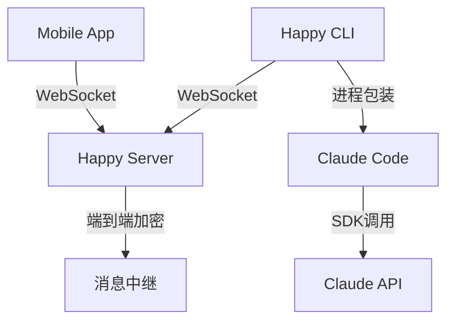

# Happy 项目支持 GitHub Copilot CLI 可行性分析

## 📋 项目概述

### Happy 项目架构

Happy 是一个开源的移动客户端,用于远程控制 Claude Code 和 Codex。它采用三层架构:



**核心组件**:

1. **happy-cli** - 命令行包装器
   - 包装 Claude Code 进程
   - 拦截 I/O 进行状态追踪
   - 通过 WebSocket 与服务器通信
   - 支持本地模式和远程控制模式

2. **happy-server** - Node.js 中继服务器
   - 处理加密消息路由
   - 会话管理和同步
   - 实时消息推送
   - 用户认证和授权

3. **happy (mobile app)** - React Native 移动客户端
   - iOS/Android/Web 支持
   - 端到端加密通信
   - 实时会话控制
   - 语音助手集成

### GitHub Copilot CLI 架构

GitHub Copilot CLI 是一个命令行工具,提供:

- 交互式 AI 辅助
- 模型选择 (Claude Sonnet 4.5, GPT-4 等)
- 文件和目录访问管理
- 命令历史和上下文管理
- GitHub 账户集成

## 🔍 技术对比分析

### 1. 进程包装机制

#### Claude Code 包装实现

Happy CLI 使用两种方式包装 Claude Code:

**本地模式 (claudeLocal.ts)**:
```typescript
// 生成全局 Claude CLI 并通过自定义 launcher 拦截
const child = spawn('node', [claudeCliPath, ...args], {
    stdio: ['inherit', 'inherit', 'inherit', 'pipe'],
    signal: opts.abort,
    cwd: opts.path,
    env: {...process.env, ...opts.claudeEnvVars}
});

// 监听自定义 fd (fd 3) 获取状态
const rl = createInterface({
    input: child.stdio[3],
    crlfDelay: Infinity
});
```

**远程模式 (claudeRemote.ts)**:
```typescript
// 使用 SDK 方式调用
import { query } from '@/claude/sdk';

const sdkOptions: Options = {
    cwd: opts.path,
    resume: startFrom,
    mcpServers: opts.mcpServers,
    permissionMode: initial.mode.permissionMode,
    model: initial.mode.model,
    canCallTool: (toolName, input, options) => 
        opts.canCallTool(toolName, input, mode, options)
};

for await (const message of query({
    prompt: promptStream,
    options: sdkOptions
})) {
    // 处理消息流
}
```

#### Copilot CLI 特点

Copilot CLI 可能的架构:
- 基于 Node.js 的命令行工具
- 使用 GitHub API 进行认证
- 支持多种 AI 模型
- 交互式命令处理

### 2. 认证机制对比

#### Claude Code 认证

```typescript
// Happy 使用 Anthropic OAuth
const CLIENT_ID = '9d1c250a-e61b-44d9-88ed-5944d1962f5e';
const CLAUDE_AI_AUTHORIZE_URL = 'https://claude.ai/oauth/authorize';
const TOKEN_URL = 'https://console.anthropic.com/v1/oauth/token';

// PKCE 流程
function generatePKCE(): PKCECodes {
    const verifier = randomBytes(32).toString('base64url');
    const challenge = createHash('sha256')
        .update(verifier)
        .digest('base64url');
    return { verifier, challenge };
}
```

#### Copilot CLI 认证

```typescript
// Copilot 使用 GitHub OAuth + Device Flow
> /login

// 显示授权码和 URL
Enter one-time code: 2EA9-619A at https://github.com/login/device

// 用户在浏览器中完成授权
● Signed in successfully as WingBot!
```

### 3. 消息协议对比

#### Claude Code 消息格式

```typescript
// Happy 的加密消息格式
type SessionMessageContent = {
    t: 'encrypted';
    c: string; // Base64 编码的加密内容
};

// 原始消息格式
type RawRecord = {
    role: 'user' | 'agent';
    content: {
        type: 'text' | 'output';
        text?: string;
        data?: any;
    };
    meta?: {
        sentFrom?: string;
        permissionMode?: string;
        model?: string;
    };
};
```

#### Copilot CLI 消息格式

从现有信息推断,可能使用类似格式:
```typescript
// 假设的 Copilot 消息格式
type CopilotMessage = {
    type: 'user' | 'assistant' | 'system';
    content: string;
    metadata?: {
        model?: string;
        timestamp?: number;
    };
};
```

## 🔧 技术实现方案

### 方案一: 轻量级包装 (推荐)

**设计思路**: 最小化修改,复用现有架构

```typescript
// 新建 copilotLocal.ts
export async function copilotLocal(opts: {
    abort: AbortSignal,
    sessionId: string | null,
    path: string,
    onSessionFound: (id: string) => void,
    onThinkingChange?: (thinking: boolean) => void,
    copilotEnvVars?: Record<string, string>,
    copilotArgs?: string[]
}) {
    // 检查 Copilot CLI 是否安装
    const copilotPath = findCopilotPath(); // 查找全局安装
    
    // 生成会话 ID
    const sessionId = opts.sessionId || randomUUID();
    
    // 启动 Copilot 进程
    const child = spawn('copilot', [
        '--session-id', sessionId,
        ...opts.copilotArgs || []
    ], {
        stdio: ['pipe', 'pipe', 'pipe'],
        signal: opts.abort,
        cwd: opts.path,
        env: {...process.env, ...opts.copilotEnvVars}
    });
    
    // 拦截 stdin/stdout 进行消息追踪
    child.stdout.on('data', (data) => {
        const output = data.toString();
        // 解析 Copilot 输出并转换为 Happy 格式
        parseAndForwardCopilotOutput(output, sessionId);
    });
    
    child.stdin.on('data', (data) => {
        const input = data.toString();
        // 追踪用户输入
        trackUserInput(input, sessionId);
    });
}
```

**优点**:
- 实现简单,风险低
- 复用现有的会话管理、加密、通信机制
- 不需要修改 server 和 mobile app

**缺点**:
- 无法深度集成 Copilot 特性
- 可能无法获取详细的内部状态

### 方案二: SDK 集成

**设计思路**: 如果 Copilot 提供 Node.js SDK,可深度集成

```typescript
// 新建 copilot/sdk/query.ts
import { CopilotSDK } from '@github/copilot-sdk';

export async function* copilotQuery(config: {
    prompt: string | AsyncIterable<string>,
    options: CopilotQueryOptions
}): AsyncGenerator<CopilotMessage> {
    const sdk = new CopilotSDK({
        token: config.options.githubToken,
        model: config.options.model || 'claude-sonnet-4.5'
    });
    
    // 流式处理响应
    for await (const chunk of sdk.chat(config.prompt)) {
        yield {
            type: chunk.role,
            content: chunk.content,
            metadata: {
                model: chunk.model,
                timestamp: Date.now()
            }
        };
    }
}
```

**优点**:
- 深度集成,功能完整
- 可以访问 Copilot 的所有 API
- 更好的错误处理和状态管理

**缺点**:
- 依赖 Copilot SDK 的存在和稳定性
- 需要处理 GitHub 认证流程
- 实现复杂度较高

### 方案三: MCP (Model Context Protocol) 集成

**设计思路**: 利用 Happy 现有的 MCP 支持

```typescript
// 配置 Copilot 为 MCP 服务器
const mcpServers = {
    'copilot': {
        type: 'stdio' as const,
        command: 'copilot',
        args: ['--mcp-mode'],
        env: {
            GITHUB_TOKEN: process.env.GITHUB_TOKEN
        }
    }
};

// 在 Claude Code 中使用 Copilot 工具
await loop({
    path: workingDirectory,
    model: 'claude-sonnet-4.5',
    mcpServers: mcpServers,
    // Copilot 工具将通过 MCP 协议可用
    allowedTools: ['mcp__copilot__*']
});
```

**优点**:
- 标准化协议,兼容性好
- 可以同时使用 Claude Code 和 Copilot
- 利用现有的 MCP 基础设施

**缺点**:
- Copilot 可能不支持 MCP 协议
- 需要两个 AI 协同工作,可能产生冲突

## 📊 功能映射表

| 功能 | Claude Code (Happy) | Copilot CLI | 实现难度 |
|------|-------------------|-------------|---------|
| 会话管理 | ✅ 完整支持 | ✅ 支持 | 🟢 低 |
| 文件操作 | ✅ Read/Write/Edit | ✅ 文件访问 | 🟢 低 |
| 命令执行 | ✅ Bash 工具 | ❓ 未知 | 🟡 中 |
| 权限管理 | ✅ Permission Mode | ❓ 未知 | 🟡 中 |
| 模型切换 | ✅ 多模型支持 | ✅ 多模型 | 🟢 低 |
| 远程控制 | ✅ 核心功能 | ❌ 不支持 | 🔴 高 |
| 端到端加密 | ✅ 完整实现 | ❌ 不支持 | 🔴 高 |
| 语音输入 | ✅ 集成 11Labs | ❌ 不支持 | 🟡 中 |
| 推送通知 | ✅ 支持 | ❌ 不支持 | 🟡 中 |

## 🚧 实现挑战

### 1. 认证流程差异

**Claude Code**: 
- 使用 Anthropic 账户
- OAuth + PKCE 流程
- 存储在 `~/.claude` 目录

**Copilot CLI**:
- 使用 GitHub 账户
- Device Flow 认证
- 需要 GitHub Copilot 订阅

**解决方案**:
```typescript
// 统一认证管理器
interface AuthProvider {
    name: 'claude' | 'copilot' | 'codex';
    authenticate(): Promise<Credentials>;
    refresh(): Promise<Credentials>;
    logout(): Promise<void>;
}

class CopilotAuthProvider implements AuthProvider {
    name = 'copilot' as const;
    
    async authenticate(): Promise<Credentials> {
        // 实现 GitHub Device Flow
        const deviceCode = await this.requestDeviceCode();
        const pollInterval = deviceCode.interval * 1000;
        
        // 显示授权码
        console.log(`Enter code: ${deviceCode.user_code}`);
        console.log(`Visit: ${deviceCode.verification_uri}`);
        
        // 轮询认证状态
        while (true) {
            await sleep(pollInterval);
            try {
                const token = await this.pollToken(deviceCode.device_code);
                return { token, provider: 'copilot' };
            } catch (e) {
                // 继续轮询
            }
        }
    }
}
```

### 2. 消息格式转换

需要在 Copilot 和 Happy 消息格式之间转换:

```typescript
// 消息适配器
class CopilotMessageAdapter {
    // Copilot -> Happy 格式
    toHappyMessage(copilotMsg: CopilotMessage): RawRecord {
        return {
            role: copilotMsg.type === 'assistant' ? 'agent' : 'user',
            content: {
                type: 'text',
                text: copilotMsg.content
            },
            meta: {
                sentFrom: 'copilot-cli',
                model: copilotMsg.metadata?.model,
                timestamp: copilotMsg.metadata?.timestamp
            }
        };
    }
    
    // Happy -> Copilot 格式
    toCopilotMessage(happyMsg: RawRecord): CopilotMessage {
        return {
            type: happyMsg.role === 'agent' ? 'assistant' : 'user',
            content: happyMsg.content.text || '',
            metadata: {
                model: happyMsg.meta?.model,
                timestamp: Date.now()
            }
        };
    }
}
```

### 3. 工具调用机制

Copilot CLI 的工具调用可能与 Claude Code 不同:

```typescript
// 统一工具接口
interface ToolCall {
    id: string;
    name: string;
    arguments: Record<string, any>;
    status: 'pending' | 'running' | 'completed' | 'failed';
    result?: any;
}

class CopilotToolHandler {
    async handleToolCall(tool: ToolCall): Promise<any> {
        switch (tool.name) {
            case 'read_file':
                return await this.readFile(tool.arguments.path);
            case 'execute_command':
                return await this.executeCommand(tool.arguments.command);
            // ... 其他工具
        }
    }
}
```

## 💡 推荐实施步骤

### 阶段 1: 可行性验证 (1-2 周)

1. **环境搭建**
   ```bash
   # 安装 Copilot CLI
   npm install -g @github/copilot
   
   # 测试基本功能
   copilot --help
   copilot /login
   ```

2. **进程分析**
   - 运行 Copilot CLI 并监控其 I/O
   - 分析命令格式和响应结构
   - 确定是否有 SDK 或 API 文档

3. **原型开发**
   ```typescript
   // 创建简单的 Copilot 包装器
   async function wrapCopilot() {
       const child = spawn('copilot', [], {
           stdio: ['pipe', 'pipe', 'pipe']
       });
       
       // 监控输出
       child.stdout.on('data', (data) => {
           console.log('Copilot output:', data.toString());
       });
       
       // 发送测试命令
       child.stdin.write('Hello\n');
   }
   ```

### 阶段 2: 核心功能实现 (2-3 周)

1. **创建 Copilot 适配层**
   - `copilot/copilotLocal.ts` - 本地模式包装
   - `copilot/copilotRemote.ts` - 远程模式 (如果可行)
   - `copilot/adapter.ts` - 消息格式转换

2. **集成到 Happy CLI**
   ```typescript
   // 在 index.ts 中添加 Copilot 支持
   if (args.includes('copilot')) {
       await runCopilot(credentials, options);
   } else {
       await runClaude(credentials, options);
   }
   ```

3. **会话管理**
   - 复用现有的 `ApiSessionClient`
   - 添加 `flavor: 'copilot'` 标记
   - 实现 Copilot 专用的元数据

### 阶段 3: 移动端集成 (1-2 周)

1. **UI 适配**
   - 在 Mobile App 中添加 Agent 类型选择
   - 显示 Copilot 特定的状态和图标
   - 适配消息渲染逻辑

2. **功能测试**
   - 端到端加密验证
   - 实时消息同步测试
   - 权限管理测试

### 阶段 4: 优化和发布 (1 周)

1. **性能优化**
   - 减少消息转换开销
   - 优化连接管理
   - 改进错误处理

2. **文档编写**
   - 用户指南
   - API 文档
   - 故障排除指南

## ⚠️ 潜在风险和限制

### 技术风险

1. **Copilot CLI 封闭性**
   - GitHub 可能限制第三方包装
   - 可能缺少公开的 API/SDK
   - 协议可能随时变更

2. **认证复杂性**
   - 需要维护两套认证系统
   - 可能存在 Token 冲突
   - 订阅验证问题

3. **功能兼容性**
   - Copilot 可能不支持某些 Happy 特性
   - 远程控制可能受限
   - 工具调用机制可能不同

### 法律和政策风险

1. **服务条款**
   - GitHub Copilot 服务条款可能禁止包装
   - 可能违反使用协议
   - 商业使用限制

2. **知识产权**
   - 确保不侵犯 GitHub/Microsoft 权利
   - 明确声明非官方客户端
   - 遵守开源许可

## 🎯 结论和建议

### 可行性评估

| 方面 | 评分 | 说明 |
|------|------|------|
| 技术可行性 | ⭐⭐⭐⚪⚪ | 3/5 - 有技术挑战但可实现 |
| 实现成本 | ⭐⭐⚪⚪⚪ | 2/5 - 需要较多开发工作 |
| 维护成本 | ⭐⭐⭐⚪⚪ | 3/5 - 需要持续适配 |
| 用户价值 | ⭐⭐⭐⭐⚪ | 4/5 - 有较大需求 |
| 法律风险 | ⭐⭐⚪⚪⚪ | 2/5 - 存在一定风险 |

**综合评分: 2.8/5**

### 最终建议

#### ✅ 推荐方案: 轻量级包装 + 官方支持

1. **短期目标**
   - 实现基础的进程包装
   - 支持简单的命令转发
   - 提供基本的远程查看功能

2. **长期目标**
   - 联系 GitHub 团队寻求官方支持
   - 探索 MCP 协议集成
   - 建立社区反馈机制

#### ⚠️ 风险控制

1. **明确定位**
   - 标注为"非官方"客户端
   - 说明功能限制
   - 提供官方客户端链接

2. **合规检查**
   - 审查 GitHub Copilot 服务条款
   - 咨询法律顾问
   - 准备停止方案

3. **备选计划**
   - 如果 Copilot 不可行,专注于 Claude Code
   - 考虑其他开源 AI 助手
   - 探索自建模型方案

## 📚 参考资料

### 技术文档

- [Happy CLI 源码](https://github.com/slopus/happy-cli)
- [Happy Server 源码](https://github.com/slopus/happy-server)
- [Happy Mobile 源码](https://github.com/slopus/happy)
- [Claude Code 文档](https://claude.ai/docs)
- [GitHub Copilot CLI](https://docs.github.com/copilot/github-copilot-in-the-cli)

### 相关技术

- [Model Context Protocol (MCP)](https://modelcontextprotocol.io/)
- [Socket.IO 实时通信](https://socket.io/)
- [TweetNaCl 加密库](https://tweetnacl.js.org/)
- [React Native](https://reactnative.dev/)

### Happy 项目架构图

```
happy-cli/
├── src/
│   ├── claude/          # Claude Code 集成
│   │   ├── claudeLocal.ts      # 本地模式
│   │   ├── claudeRemote.ts     # 远程模式
│   │   ├── sdk/                # Claude SDK 封装
│   │   └── loop.ts             # 主循环控制
│   ├── codex/           # Codex 集成 (已实现)
│   ├── copilot/         # Copilot 集成 (待实现)
│   │   ├── copilotLocal.ts     # 本地模式 (新建)
│   │   ├── copilotRemote.ts    # 远程模式 (新建)
│   │   └── adapter.ts          # 消息适配 (新建)
│   ├── api/             # API 客户端
│   ├── auth/            # 认证管理
│   └── daemon/          # 后台守护进程
```

### 关键代码示例

**Claude Code 进程启动**:
```typescript
// 来自 claudeLocal.ts
const child = spawn('node', [claudeCliPath, ...args], {
    stdio: ['inherit', 'inherit', 'inherit', 'pipe'],
    signal: opts.abort,
    cwd: opts.path
});
```

**消息加密和解密**:
```typescript
// 来自 encryption/index.ts
export async function encryptMessage(
    sessionKey: Uint8Array, 
    message: string
): Promise<string> {
    const nonce = randomBytes(24);
    const encrypted = secretbox(
        new TextEncoder().encode(message),
        nonce,
        sessionKey
    );
    return encodeBase64(concat(nonce, encrypted));
}
```

**WebSocket 通信**:
```typescript
// 来自 apiSocket.ts
socket.on('update', async (update) => {
    const decrypted = await encryption.decrypt(update);
    eventRouter.emitUpdate({
        userId,
        payload: decrypted,
        recipientFilter: { type: 'user-scoped-only' }
    });
});
```

---

**文档版本**: v1.0  
**创建时间**: 2025-12-10  
**作者**: AI Assistant  
**审核状态**: 待审核
